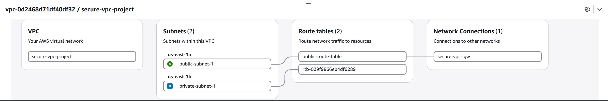

# Secure VPC Architecture on AWS

Part of my Cloud Security Architecture Journey 

## Overview

This project implements a secure, multi-AZ Virtual Private Cloud (VPC) on AWS, following core network security principles: segmentation between public and private resources, layered firewalls (Security Groups + NACLs), and least-privilege access.

## Architecture

The design separates resources into a public tier (internet-facing) and a private tier (isolated), spread across two Availability Zones for high availability.

## Components Built

| Component | Name | Details |
|---|---|---|
| VPC | `secure-vpc-project` | `10.0.0.0/16` |
| Public Subnet | `public-subnet-1` | `10.0.1.0/24`, AZ: us-east-1a |
| Private Subnet | `private-subnet-1` | `10.0.2.0/24`, AZ: us-east-1b |
| Internet Gateway | `secure-vpc-igw` | Attached to VPC |
| Route Table | `public-route-table` | `0.0.0.0/0` → IGW, associated with public subnet |
| Security Group (public) | `public-sg` | Inbound: HTTP (80) from anywhere, SSH (22) from my IP only |
| Security Group (private) | `private-sg` | Inbound: MySQL (3306) from `public-sg` only |
| NACL (public) | `public-nacl` | Allows HTTP, SSH, and ephemeral return traffic |
| NACL (private) | `private-nacl` | Allows traffic only from the public subnet CIDR (`10.0.1.0/24`) |

## Design Decisions

**Multi-AZ subnets.** The public and private subnets sit in different Availability Zones (`us-east-1a` and `us-east-1b`) so that an outage in one AZ doesn't take down the whole architecture.

**Defense in depth.** Two layers of firewalling are used: Security Groups (stateful, instance-level) and Network ACLs (stateless, subnet-level). This mirrors how production AWS environments are typically secured — no single control is relied on alone.

**Private subnet isolation.** The private subnet has no route to the Internet Gateway and no security group rule that accepts traffic from outside the VPC. It only trusts traffic that has already passed through the public subnet's security group.

**NAT Gateway omitted.** A NAT Gateway was intentionally not provisioned to keep this project within AWS Free Tier limits. In a production environment, a NAT Gateway would be added to the private subnet's route table to allow outbound-only internet access (e.g. for patching), without exposing the subnet to inbound internet traffic.

## What This Demonstrates

- IPv4 CIDR planning and subnetting
- Public/private network segmentation
- Stateful vs. stateless firewall design (Security Groups vs. NACLs)
- High-availability design across Availability Zones
- Cost-conscious architecture decisions

## Next Steps (Portfolio Roadmap)

- Stage 3: IAM Security Audit
- Stage 4: CloudTrail, GuardDuty, Security Hub

---
*Built as part of a self-directed AWS cloud security learning path, alongside AWS Certified Cloud Practitioner (CLF-C02) certification.*
