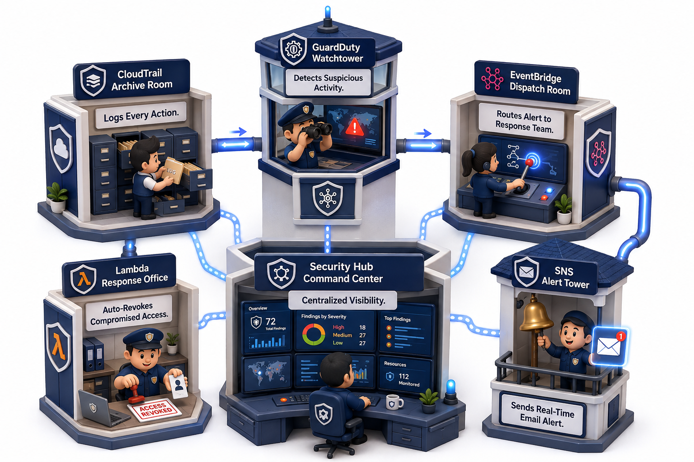
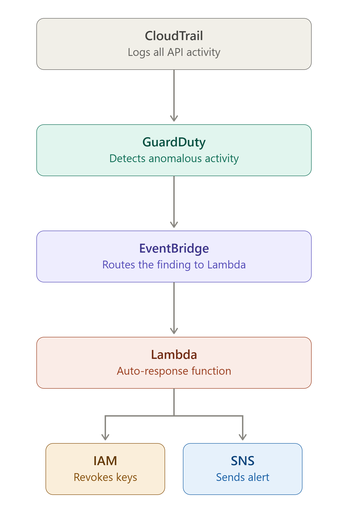
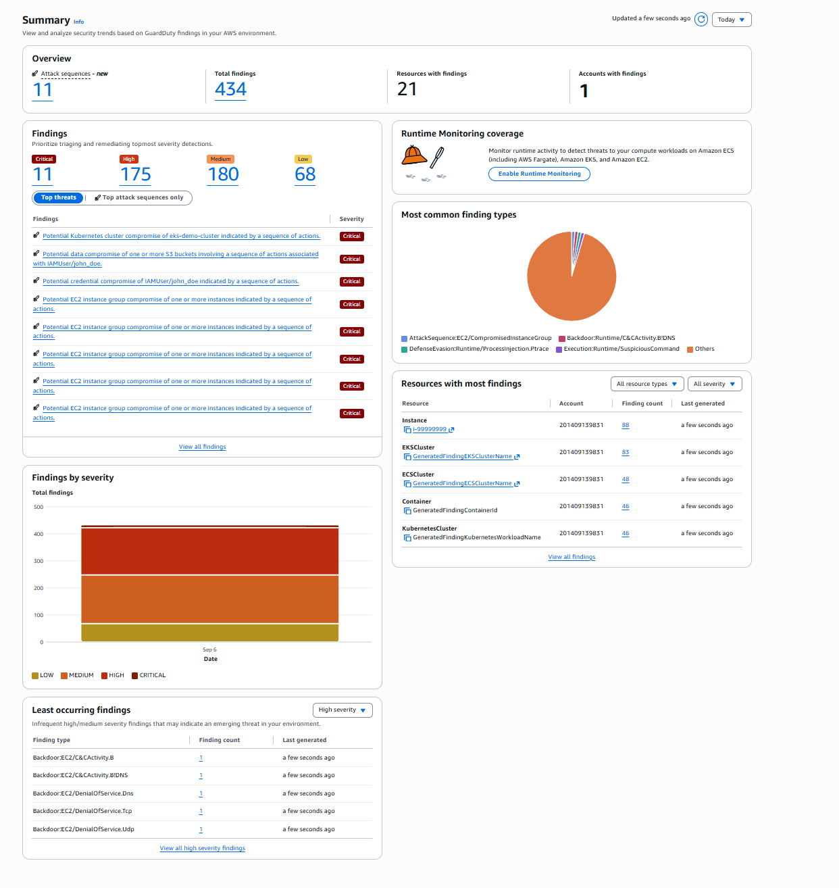

# Threat Detection & Automated Response — AWS

## Overview

This project implements an automated threat detection and response pipeline on AWS. Instead of simply enabling monitoring services, it establishes a complete **detect, respond, and alert** cycle. When Amazon GuardDuty identifies suspicious activity, the system automatically investigates the affected IAM identity, revokes its access, and notifies the security team in real time, with no manual intervention required.

## Architecture

**Flow:** AWS CloudTrail logs all account activity. Amazon GuardDuty analyzes this activity for anomalies. Amazon EventBridge routes any finding to an AWS Lambda function, which deactivates the associated IAM user's access keys and publishes an alert through Amazon SNS.

## Components

1. **AWS CloudTrail** continuously logs all API activity within the account, including management events.
2. **Amazon GuardDuty** analyzes CloudTrail logs, VPC Flow Logs, and DNS logs to detect anomalous or unauthorized behavior.
3. **Amazon EventBridge** listens for GuardDuty findings and triggers the response Lambda function.
4. **AWS Lambda** parses the finding, identifies the associated IAM user (if applicable), and deactivates their access keys to contain the threat.
5. **Amazon SNS** sends a real-time email alert summarizing the finding and the action taken.
6. **AWS Security Hub** aggregates findings from GuardDuty into a single dashboard for centralized visibility.

## Simulated Incident

A GuardDuty finding was generated to simulate unauthorized API activity. Amazon EventBridge routed the finding to the response Lambda function within seconds. The Lambda function identified the associated IAM user, deactivated their access keys, and published an alert through SNS, confirmed by email delivery within seconds of the finding being generated.

## Proof of Deployment

## Security Considerations

The Lambda execution role in this demonstration uses `IAMFullAccess` and `AmazonSNSFullAccess` for simplicity. **In a production environment, this would be replaced with a scoped-down custom policy** granting only `iam:UpdateAccessKey` and `iam:ListAccessKeys` on specific resources, along with `sns:Publish` restricted to the relevant topic, in accordance with the principle of least privilege.

All services used in this project, including GuardDuty and Security Hub, were operated within their 30-day free trial period and disabled afterward to avoid ongoing charges. Testing was conducted using GuardDuty's built-in sample findings feature rather than live attack simulation, keeping the environment safe and cost-free.

## Tech Stack

`AWS CloudTrail` · `Amazon GuardDuty` · `Amazon EventBridge` · `AWS Lambda (Python)` · `AWS IAM` · `Amazon SNS` · `AWS Security Hub`
